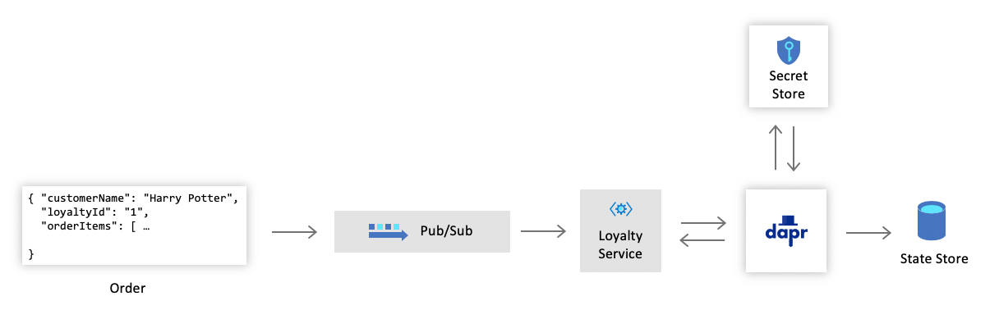

# Challenge 3: Loyalty Service

The Cloud Coffee Company provides their customers with a loyalty program that manages rewards and keeps track of the points they accrue when purchasing drinks. The company is looking forward to onboarding the program into this new solution and needs your help with the remaining functionality.

In the [previous challenge](challenge-2.md), you introduced the Dapr [pub/sub](https://docs.dapr.io/operations/components/setup-pubsub/) component into the solution which enabled the Loyalty service to subscribe to incoming orders. This challenge will continue to enhance the service by incorporating two additional Dapr components: [state management](https://docs.dapr.io/developing-applications/building-blocks/state-management/state-management-overview/) and [secrets management](https://docs.dapr.io/developing-applications/building-blocks/secrets/secrets-overview/).

## State Management

Dapr provides reliable state management to applications through a building block API. Developers leverage this API to retrieve, save and delete state values by providing keys. Similar to the pub/sub component, the API provides a consistent interface to whichever state store you choose.

## Secrets Management

Dapr offers developers a consistent way to extract application secrets, without needing to know the specifics of the secret store being used. Secret stores are another key component in Dapr. Using the secrets building block API, you can easily read secrets that can be used by the application from a named secrets store.

## Challenge

By incorporating store and secrets management into the solution, Cloud Coffee Company will like to implement a design that is represented in the following diagram:



### Update and Save Customer Points

- Use any of the [supported state stores](https://docs.dapr.io/operations/components/setup-state-store/supported-state-stores/) to configure a state management component for the Loyalty service. Using the [state API](https://docs.dapr.io/reference/api/state_api/), the store will be used to persist and keep track of customer points.

  - Sample loyalty record:

     ```JSON
    {
        "customerName": "Matt Murdock",
        "loyaltyId": "1000",
        "pointTotal": 400,
        "pointsEarned": 150
    }
    ```

- Add code to the Loyalty service that will update a customer's points each time a message is received from the `orders` topic. As an example, award 10 points for each dollar spent and increment the points total accordingly.

- Add the application ID for the Loyalty service, `loyalty-service`, to the list of applications that can access the state store and secret store components.

### Securing Credentials

- Select and configure a [supported secret store](https://docs.dapr.io/reference/components-reference/supported-secret-stores/) for the Loyalty service.
- Update the state store component to retrieve any credentials and sensitive information from the secret store.
- Add the necessary [scopes](https://docs.dapr.io/operations/components/component-scopes/#application-access-to-components-with-scopes) to both the **state** and **secret** store components to ensure that only the Loyalty service has access.

## Success Criteria

- Submit a customer order and confirm that their loyalty points are updated and persisted in the state store.
- Submit an order to the **Order** service to prove that pub/sub is working as expected. This can be achieved using the website, curl, Postman or the rest samples.
- Demonstrate that you can retrieve and update values from the state store successfully.
- Confirm that all sensitive information, such as connection strings and keys, are not present within the state store configuration.

## References

- [State management overview](https://docs.dapr.io/developing-applications/building-blocks/state-management/state-management-overview/)
- [Supported state stores](https://docs.dapr.io/operations/components/setup-state-store/supported-state-stores/)
- [State store components](https://docs.dapr.io/operations/components/setup-state-store/setup-state-store-overview/)
- [State API](https://docs.dapr.io/reference/api/state_api/)
- [Secrets management overview](https://docs.dapr.io/developing-applications/building-blocks/secrets/secrets-overview/)
- [Supported secret stores](https://docs.dapr.io/reference/components-reference/supported-secret-stores/)
- [Secret store components](https://docs.dapr.io/operations/components/setup-secret-store/)
- [Secret Store API](https://docs.dapr.io/reference/api/secrets_api/)
- [Secret store for Azure Key Vault](https://docs.dapr.io/operations/components/setup-secret-store/supported-secret-stores/azure-keyvault/)
- [Component Scopes on Dapr](https://docs.dapr.io/operations/components/component-scopes/)

## Next Challenge

After you have both state management and secrets management configured, continue with the next challenge to [process orders](challenge-4.md).
